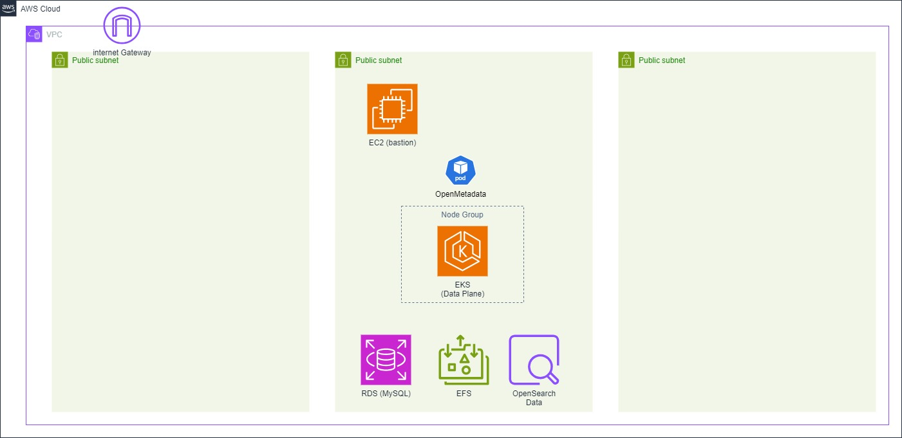

# OpenMetadata

AWS 上に OpenMetadata の環境を作成する。

## デプロイ手順

前提として、対象 AWS 環境向けの profile 名を `private` に設定して利用する。

1. AWS CDK デプロイ
   - > npm run deploy
2. OpenMetadata デプロイ
   - [docs/deploy-OpenMetadata.md](./docs/deploy-OpenMetadata.md) を参照
3. [troubleshooting](./docs/troubleshooting.md)

## AWS 構成図

### 作成される環境

### Production 想定環境

OpenMetadata, AWS それぞれの推奨 production 構成を採用したもの。

.jpg>)

## 想定 AWS 利用料

上記の Production 想定環境に対して、OpenMetadata 推奨最低スペックのリソースを選定した金額。非 Savings Plans。

|          |       USD |
| -------- | --------: |
| Monthly  |  1,259.50 |
| Annually | 15,114.00 |

- [AWS Pricing Calculator](https://calculator.aws/#/estimate?id=fe4b10d9844d76d4600fc8d9ab22b2688105bf04)
- [pdf](./docs/aws-pricing.pdf)

## Requirement

### 各コンポーネントの対応バージョン

> Amazon RDS (MySQL) engine version 8 or higher

> Amazon RDS (PostgreSQL) engine version 12 or higher

> Amazon OpenSearch engine version 2.X (upto 2.7)

> Amazon RDS to be in Multiple Availability Zones.

> Amazon OpenSearch (or ElasticSearch) Service with Multiple Availability Zones with minimum 2 Nodes.

[AWS Services for Database as RDS and Search Engine as ElasticSearch](https://docs.open-metadata.org/latest/deployment/kubernetes/eks#aws-services-for-database-as-rds-and-search-engine-as-elasticsearch)

### 各コンポーネントの推奨最低スペック

> We recommend you to allocate openmetadata-server with minimum of 2vCPUs and 6 GiB Memory.

> For the database, minimum 2 vCPUs and 2 GiB RAM (per instance) with 30 GiB of Storage Volume Attached (dynamic expansion up to 100 GiB)

> For Elasticsearch, minimum 2 vCPUs and 2 GiB RAM (per instance) with 30 GiB of Storage volume attached

[Minimum Sizing Requirements](https://docs.open-metadata.org/latest/deployment/docker#minimum-sizing-requirements)

スペックが低すぎると、OpenMetadata の pod がそもそも起動してくれない。

## 参考情報

- 公式ドキュメント
  - [EKS on Amazon Web Services Deployment | OpenMetadata](https://docs.open-metadata.org/latest/deployment/kubernetes/eks#eks-on-amazon-web-services-deployment)
- OpenMetadata デプロイ用の Helm Chart
  - [openmetadata-helm-charts | GitHub](https://github.com/open-metadata/openmetadata-helm-charts)
- 参考ブログ
  - [OpenMetadata Deployment on AWS EKS Using Helm](https://medium.com/@dana.fatadilla123/openmetadata-deployment-on-aws-eks-using-helm-b1b4854f0759)
  - [Deploying OpenMetadata on AWS EKS: A Step-by-Step Guide](https://medium.com/@arvindpant/deploying-openmetadata-on-aws-eks-a-step-by-step-guide-e5883b7e19bf)
